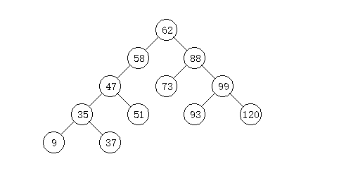

独立看待节点，只看节点的一级子节点

1. 遍历节点，在一节点为根的情况下，求包含此节点的最大路径和
2. 如果是叶子节点，最大路径和 = 自身的值
3. 如果不是叶子节点，最大路径有几种可能
   1. 只包含根节点
   2. 包含根节点和1个子节点
   3. 包含根节点和2个子节点
4. 对于情况#1和情况#2，对于"全局最大路径和"保留了向外延伸的可能，对于当前根节点的父节点可以直接使用#1和#2和结果计算父节点的最大路径和
5. 对于情况#3，最大路径和闭环在当前根节点下，无法再向外延伸。这种情况需要和全局最大值比较并记录